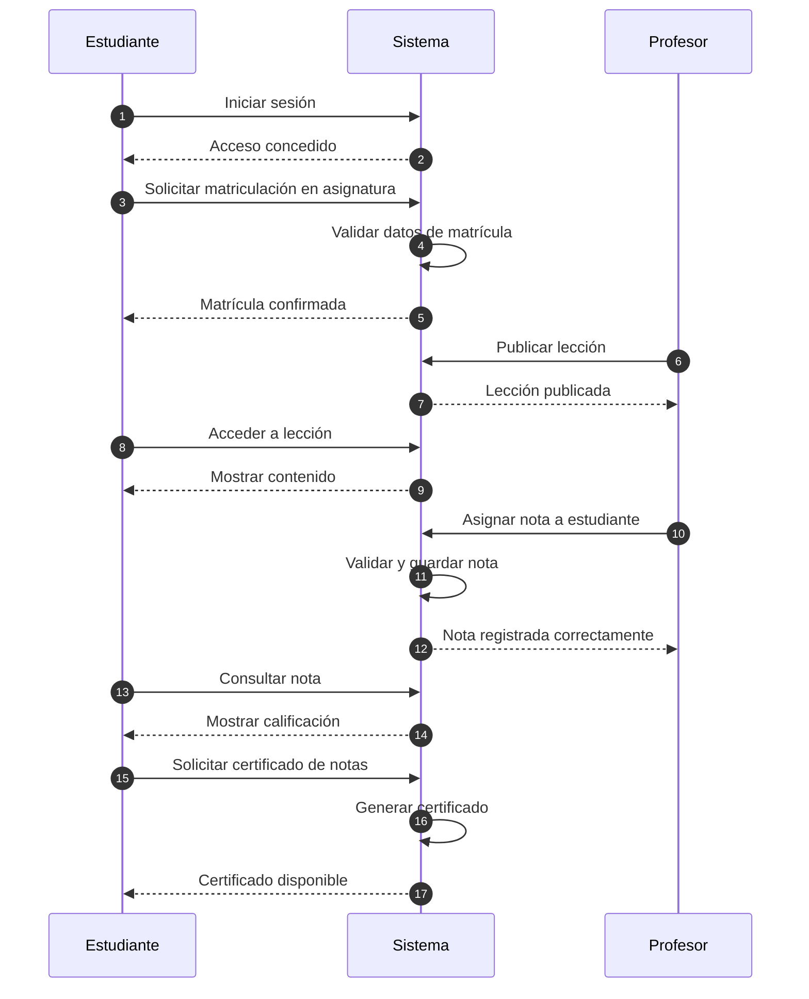

# Requisitos

## Requisitos Funcionales

- La aplicación debe permitir el registro de usuarios, y gestionar los perfiles de estos.

- Los estudiantes deben poder matricularse en las asignaturas, ver en cuales está matriculado y solicitar el certificado de notas

- Los profesores deben tener acceso a las asignaturas que imparte y a los alumnos que están matriculados en sus asignaturas, así como asignarles una nota a cada estudiante.

## Requisitos no Funcionales

- El sistema debe ofrecer un rendimiento óptimo para un número moderado de usuarios simultáneos.

- Debe garantizar la seguridad de los datos mediante mecanismos de autenticación y control de acceso.

- La interfaz debe ser intuitiva y fácil de usar para usuarios.

## Restricciones

- La aplicación está limitado por el uso del framework Django y una base
  de datos relacional.

- Se deben cumplir la ley de protección de datos, evitando el almacenamiento de información sensible

## Casos de Uso



```md
Este diagrama de secuencia representa el flujo de interacción entre el estudiante,
el profesor y el sistema durante el proceso de matriculación,
acceso a los contenidos y notas
```
