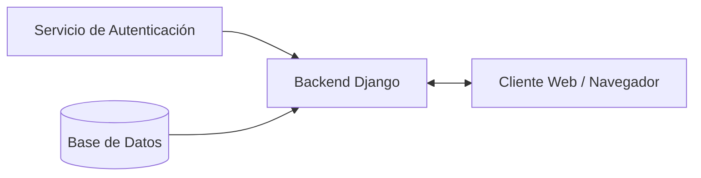
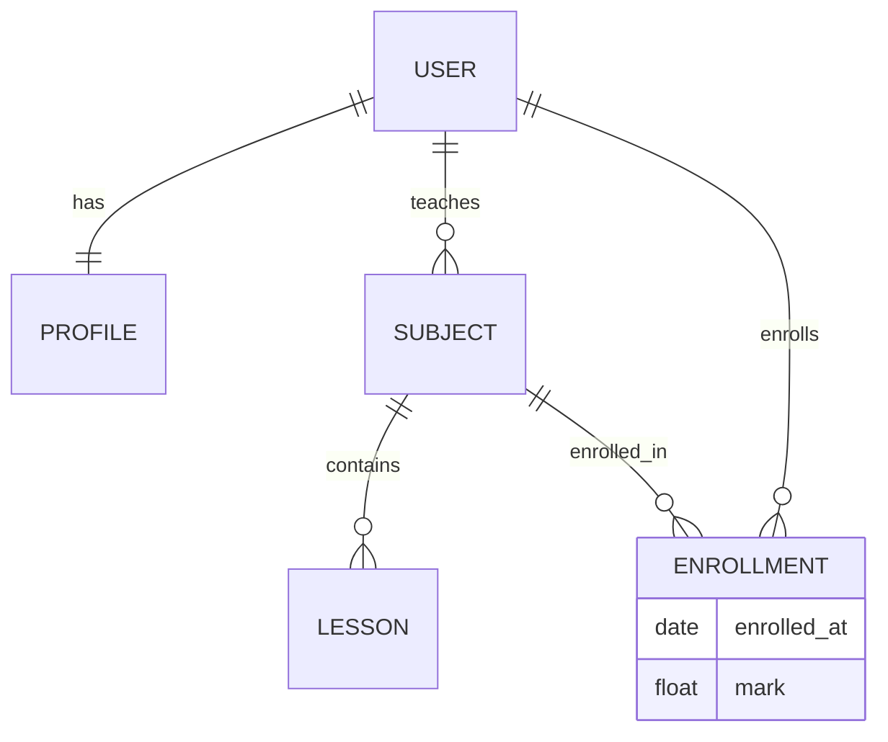
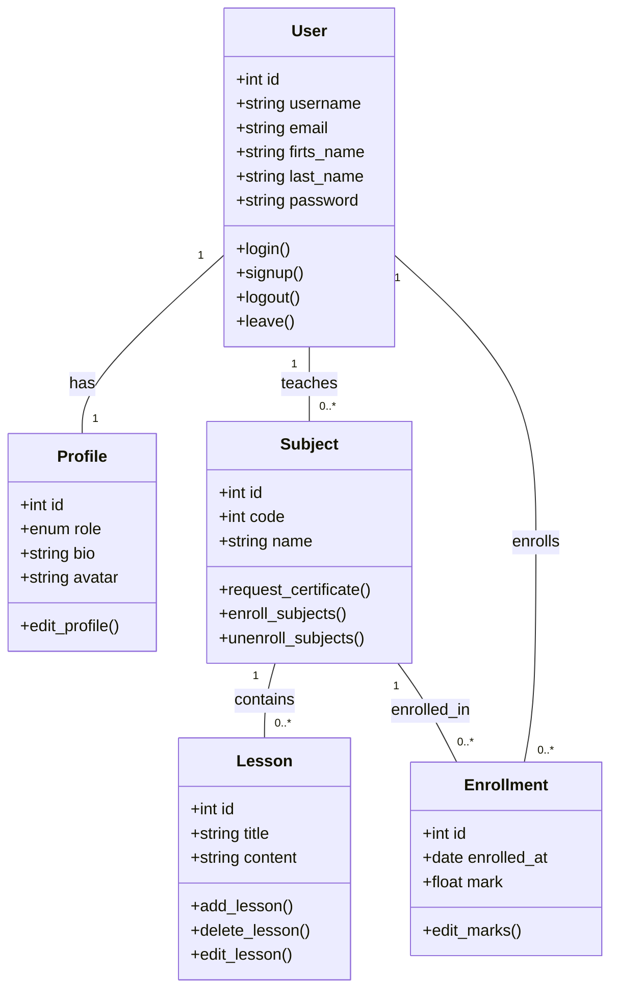

# Diseño

## Arquitectura del Sistema

| Componente                | Descripción                                                            |
| ------------------------- | ---------------------------------------------------------------------- |
| Cliente Web / Navegador   | Interfaz desde la que el usuario accede al sistema y envía solicitudes |
| Backend Django            | Gestiona la lógica de negocio y el flujo de datos del sistema          |
| Base de Datos             | Almacenamiento persistente de la información                           |
| Servicio de Autenticación | Gestión de usuarios, sesiones y control de acceso                      |

## Modelo de Datos

## Diagramas

## Decisiones de Diseño

- Django permite pasar del concepto al producto rápidamente gracias a su filosofía de "pilas incluidas". Ya trae integradas funciones que en otros frameworks requieren librerías externas.

- Al usar el sistema de plantillas de Django para el frontend, mantienes toda la lógica en un solo lenguaje (Python), evitando la complejidad de gestionar un framework de JavaScript (como React o Vue) si el proyecto no lo requiere estrictamente.

- Es mucho más sencillo desplegar y escalar una única aplicación que gestionar microservicios independientes.

- Python es reconocido por su sintaxis clara, lo que facilita que otros desarrolladores lean el código. Además, cuenta con un ecosistema de librerías inmenso para futuras expansiones (análisis de datos, IA, etc.).
